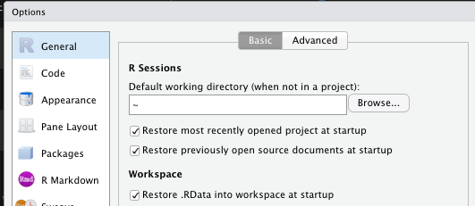

```{r setup, include = FALSE}
library(lubridate)
library(kableExtra)
```
## Introduction

This lecture covers three aspects: 

- Installing R and R Studio
- Familiarizing ourselves with the layout and functionality of RStudio
- A sneak preview of R's possibilities

## What is R?

Wikipedia: 

> R is a programming language and free software environment for statistical computing and graphics supported by the R Foundation for Statistical Computing.[6] The R language is widely used among statisticians and data miners for developing statistical software[7] and data analysis.[8] Polls, data mining surveys, and studies of scholarly literature databases show substantial increases in popularity;[9] as of February 2020, R ranks 13th in the TIOBE index, a measure of popularity of programming languages.[10] 

## Popularity of R


## Popularity of R

R usage is on the rise! What are the reasons?

- Accessibility
- Open Source
- Large community of programmers
- Amazing Functionality:
  - Statistics
  - Machine Learning
  - OCR
  - Data Visualization
  - Web Scraping
  - Text Mining
  
## Installing R 

- R is the **programming language**, RStudio is a client that makes it accessible.
- Hard to imagine programming in R without RStudio. 
  - Data Viewer
  - Keep track of environment
  - Access to function and package documentation

- Download the most recent version of R from https://cran.rstudio.com/ 
- The website will offer you the correct version for your OS
- As of `r lubridate::day(today())` `r lubridate::month(today(), label = TRUE)`, the most recent R version is 4.0.0! 

## Installing RStudio

- Go to [the official RStudio website](https://rstudio.com/products/rstudio/download/#download) 
- Or Google: Download RStudio


## Windows Users

- Select the appropriate installer (for Windows: .exe)

- Follow the setup wizard: the default options are fine. Make sure to select ' 64-bit Files', 'Message translations' and 'Core Files', under components. 

- Don't specify the startup options but accept the default. 

- Determine whether you want shortcuts on your desktop, wait until the wizard has finished and start Rstudio. 

## MacOS Users

- Download and install the most recent version of R from https://cran.rstudio.com/ (This should be straightforward)

- Go to https://rstudio.com/products/rstudio/download/#download 

- Select the appropriate installer (for Mac: .dmg)

- Double-click it to open, and then drag and drop it to your applications folder.

## UNIX/Linux

- Download and install the most recent version of R from https://cran.rstudio.com/ (This should be straightforward)

- Go to https://rstudio.com/products/rstudio/download/#download 

- Select the appropriate installer (for Ubuntu/Debian: .deb), and an install wizard will guide you through the rest of the process. 


## Getting Started: Setting our working directory

Once you've opened Rstudio, the standard layout will look something like this: 


## The RStudio User Interface

By default, RStudio has 4 panels:

- A script editor
- The console
- The environment
- Viewer

What do you do with each of them?

## RStudio User Interface [1]

- Console:
  
  The console is a place where you enter code, and see the output of the code (in general, but not always).
  
- A script editor:

  The script editor is the place where you enter your code with the objective of storing it. If you don't see it, click the + icon on the upper left of Rstudio -> New R Script.
  
## RStudio User Interface [2]
  
- Environment:

  This is a place to keep track of your objects: data.frames, variables, but even connections and history (we'll get there). 
  
- Viewer:

  By default, the viewer Works as Finder on Mac, or Windows Explorer, but it also shows the output of Visualizations under Plots, it gives an overview of all your installed and loaded packages, and shows **function documentation**. 
  
## RStudio

Let's first open our `.Rmd` file, the file that contains these lecture notes from [the course Github page](https://github.com/Introduction-to-R/Lecture-Slides/tree/master/Rmd). 

In RStudio, we go to File > Open File, and we select the markdown document `Lecture1.Rmd` which we've just downloaded. Scroll to the part in the lecture where you can see this.

**Hint:** You can use the search function in your operating system to look for specific terms (and it also includes a Find + Replace tool!). 


## Getting our Working Directory

We will start by specifying our **working directory**. Our working directory determines from which file path we will create, or load our files by default. It is advisable to put your work somewhere on a hard-drive. Sometimes, a network server frustrates writing and saving files from R to a server-environment. You can see your default working directory by the following command:

```{r eval = FALSE}
getwd()
```

Put your mouse cursor in the above chunk, and press CTRL+Enter (cmd + Enter), or alternatively, type `getwd()` in the console, and press enter. 

## Setting our Working Directory

Now, let's set our working directory. You set your working directory by using the `setwd()` command, specifying a directory between brackets, and using quotation marks: `setwd("exampledirectory/bas")`. 

The file path to your working directory depends on your operating system: In Windows, you specify your working directory using: 

```{r eval = FALSE}
setwd("C:/Documents/My/Working/Directory")
```

On a Mac: you specify the directory starting from the root directory with a `/`:

```{r eval = FALSE}
setwd("/Users/user/Documents/MyWorkingDirectory")
```

On a UNIX system: 

```{r eval = FALSE}
setwd("/home/user/Documents/MyWorkingDirectory")
```

## Setting a Working Directory

You can also use the GUI of Rstudio to change your working directory: Session > Set Working Directory > Choose Location. Let's now consider to get a _default_ R Working Directory. 

A default working directory is the directory that is your Working Directory if you start up RStudio and do not indicate any other WD. You can go to RStudio > Preferences > General:



## Setting a default directory

Alternatively, you can change your *.Rprofile* file. An *.Rprofile* file is a script that automatically runs. You should be careful with putting things into this file, but a default working directory could be a good thing to put in there. 

The easiest way to change your .Rprofile is the following:

```{r eval = FALSE}
usethis::edit_r_profile()
```

**Don't remove anything from this file**, and simply add the command:
`setwd("File/Path/To/Your/New/WD/")`

Make sure to specify the file path in a way appropriate to your OS (e.g. Windows users: `C://My/Dir`)

## Changing the default look of Rstudio

In order to make this a little bit less boring, let us pick a nice custom look of Rstudio first (this will also make you look like an experienced programmer):

Let's go to Tools > Global Options > Appearance, pick a nice Editor theme and/or font, and click apply!

## Installing our first packages

Now, our RStudio is fully set-up! We can continue by installing our **first packages!**

Let us install the __tidyverse__! In fact, tidyverse is not so much a package as it is a **set** of packages facilitating data treatment. Try and run the following code chunk:

```{r eval = FALSE}
install.packages('tidyverse')
```

## Using packages

Packages contain functions that help us in doing what we want to do in an efficient, and often easy way. 
Not using packages comes down to attempting to reinvent the wheel

We would have to do everything using base R syntax, whereas some other people have already used base R syntax to write very complicated functions, of which we can make use.

## Installation of `tidyverse`

After we've installed our package, which just means that R put the appropriate files in the appropriate folder on your computer, we have to load it before we can use its functions. Loading a package is done as follows:

```{r warning = FALSE, message = FALSE}
library(tidyverse)
```

And it will give you some output akin to the following picture:


## Packages

This is an overview of the attached packages in the `tidyverse`, followed by an overview of **Conflicts**. Conflicts happen when two packages use the same function names (we'll get to this in a future lecture). 

In particular, RStudio automatically loads a number of fundamental packages without letting you know, among which is __stats__. `library(tidyverse)` loads __dplyr__, and __dplyr__ contains the functions `filter()` and `lag()`, which are also functions in __stats__! 

Therefore, R decides to replace the functions in __stats__ by the functions __dplyr__. Why not the other way around? Because we've loaded __dplyr__ after __stats__. 

In general, conflicts can be seen using the following command:

```{r eval = FALSE}
conflicts()
```

## Installing other packages

We can also install several packages at the same time. In order to do so, we have to __concatenate__ the names of various packages to the argument of `install.packages`:

```{r eval = FALSE}
install.packages(c("stargazer", "zoo"))
```

_Concatenation_ is used quite often in R. Every time you want to tell a function in R to evaluate apply itself to not only 1, but more arguments, you have to concatenate them. We will talk about basic R syntax in the next lecture, but consider this:

```{r}
print(1,2)

print(c(1,2))
```

## Objects and names

We have already seen a small demonstration of R's logic, which can be summarized as **doing things to objects**:

Objects can be (for example):

- Data.frames
- Functions
- Variables
- Regression output
- A World map

Functions can encompass:

- Taking the mean
- Performing a regression
- Making a graph

## Brief showcase of R's capabilities

Now we've finished our start-up, I will show some of R's standard and non-standard functionalities:

- Data wrangling (Data tidying)
- Data visualization
- Web scraping
- Regression 

## Data wrangling

Let's have a look at a dataset with historical GDP per capita numbers:

```{r dataimport}
library(readxl)

datasource <- "./data/GDPperCapita_Compact.xlsx"

gdppercapita <- read_xlsx(datasource)

```


## Data wrangling [2]

This is what the dataset looks like:

```{r tablegen, echo = FALSE, results = 'asis'}
kable(gdppercapita[1:10,1:7]) %>%
  kable_styling(position = "center")
```

## Data wrangling [3]

And this is how easy it is to 'pivot' the data into long format:

```{r pivot}
library(tidyverse) 
range <- 3:518 #Which columns do you want to wrangle

gdppercapita <- gdppercapita %>%
  pivot_longer(all_of(range), 
               names_to = "year", 
               values_to = "gdppercapita")
```

## Data wrangling [4]

This is the result:

```{r tablegen2, echo = FALSE}
kable(gdppercapita[1:10,]) %>%
  kable_styling(position = "center")
```

## Data visualization

Let us now select some countries and create a graph:

```{r graphsetup, eval = FALSE, warning = FALSE, message = FALSE}
countries <- c("Netherlands", "Germany")

gdppercapita %>%
  mutate(year = as.numeric(year)) %>%
  filter(is.element(`country name`, countries), 
         year > 1800) %>%
  ggplot(aes(x = year, 
             y = gdppercapita, 
             group = `country name`,
             color = `country name`)) + geom_line()

```

## Data visualization [2]

```{r graphmake, echo = FALSE, warning = FALSE, message = FALSE}
countries <- c("Netherlands", "Germany")

gdppercapita %>%
  mutate(year = as.numeric(year)) %>%
  filter(is.element(`country name`, countries), 
         year > 1800) %>%
  ggplot(aes(x = year, 
             y = gdppercapita, 
             group = `country name`,
             color = `country name`)) + geom_line()

```

## Web scraping

Web scraping, the art of taking information on web pages and organizing them in a systematic manner, is something else which is very easy in R.

Let us attempt to scrape the table we showed before, about popularity of programming languages [here](https://www.tiobe.com/tiobe-index/):

```{r webscrape, eval = FALSE}
library(rvest)

read_html("https://www.tiobe.com/tiobe-index/") %>%
  html_nodes("#top20") %>%
  html_table()

```

## Result

```{r webscrape2, echo = FALSE, warning = FALSE, message = FALSE}
library(rvest)

read_html("https://www.tiobe.com/tiobe-index/") %>%
  html_nodes("#top20") %>%
  html_table() %>%
  as.data.frame() %>%
  .[1:10,2:6]%>%
  kable() %>%
  kable_styling(position = "center")
```

## Regression

Regressions are also very straightforward in R (we do some data cleaning beforehand):

```{r regression}
model1 <- gdppercapita %>%
  filter(`country name`== "Netherlands") %>%
  mutate(year = as.numeric(year)) %>%
  lm(formula = gdppercapita ~ year) 
```

## Regression

And the results show a default output of regression coefficients, significance, etc. 

\tiny
```{r}
summary(model1)
```
\normalsize

